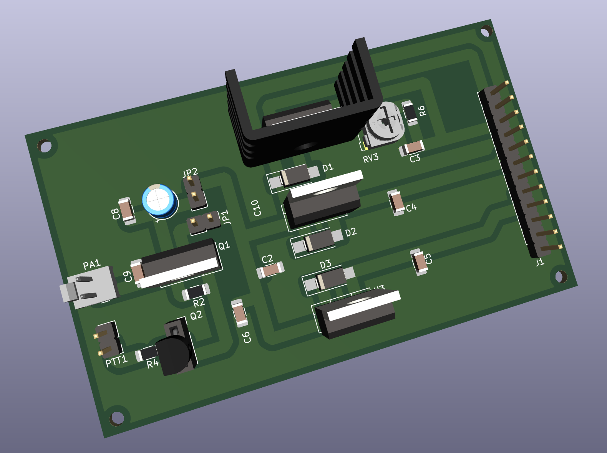
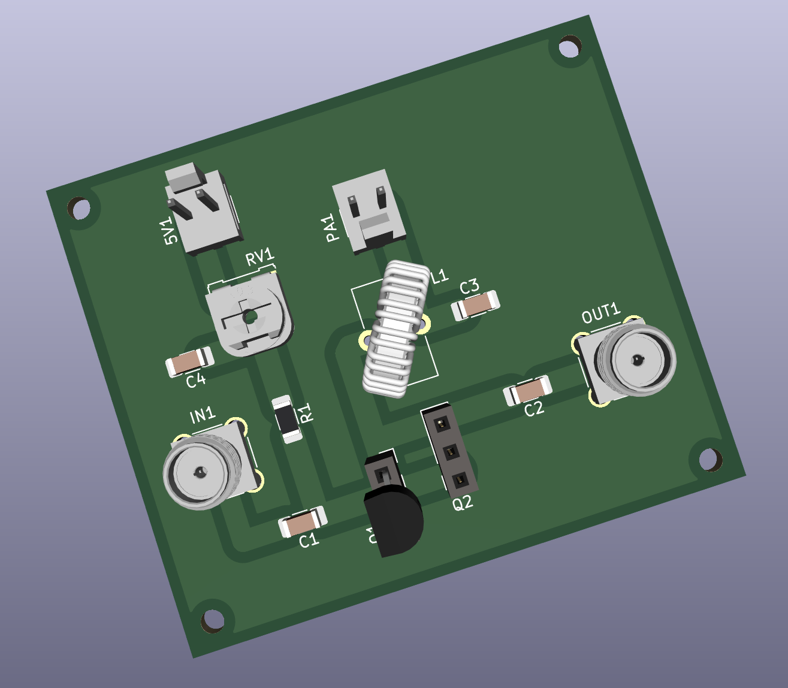
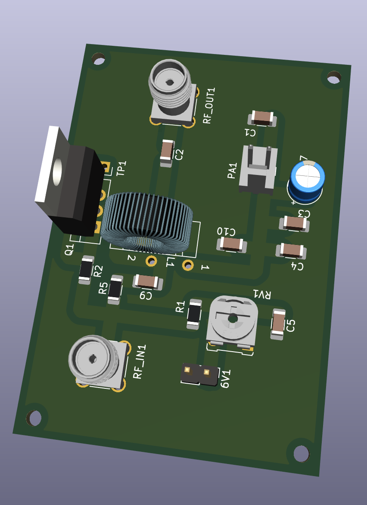

### HF-PA-v6

RF "Lego" blocks.

The idea behind this work is to build radio-things (TM) in stages which
connect to each other.

This makes the designing, and debugging processes much easier.

- [BS170 Driver Performance](./BS170-Driver-Performance.txt)

Renderings:

